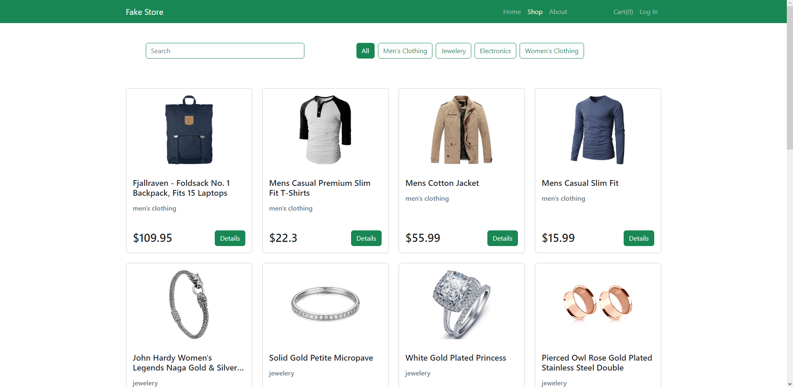

# Simple Fake Store

## About

Simple fake web shop made with React and Bootstrap-Bootstrap. Users can search and filter items by category and add them to cart. There is also an option to log in as admin. Admin page can be used to edit and remove existing items or add new ones. If new item is added with a category that doesn't exist, it will be created automatically. Also, if all items from one category are deleted, the whole category will be deleted as well.

## Built With

1. React
2. [React-Bootstrap](https://react-bootstrap.github.io)
3. [React-Icons](https://react-icons.github.io/react-icons/)

## APIs

1. [Fake Store](https://fakestoreapi.com)
